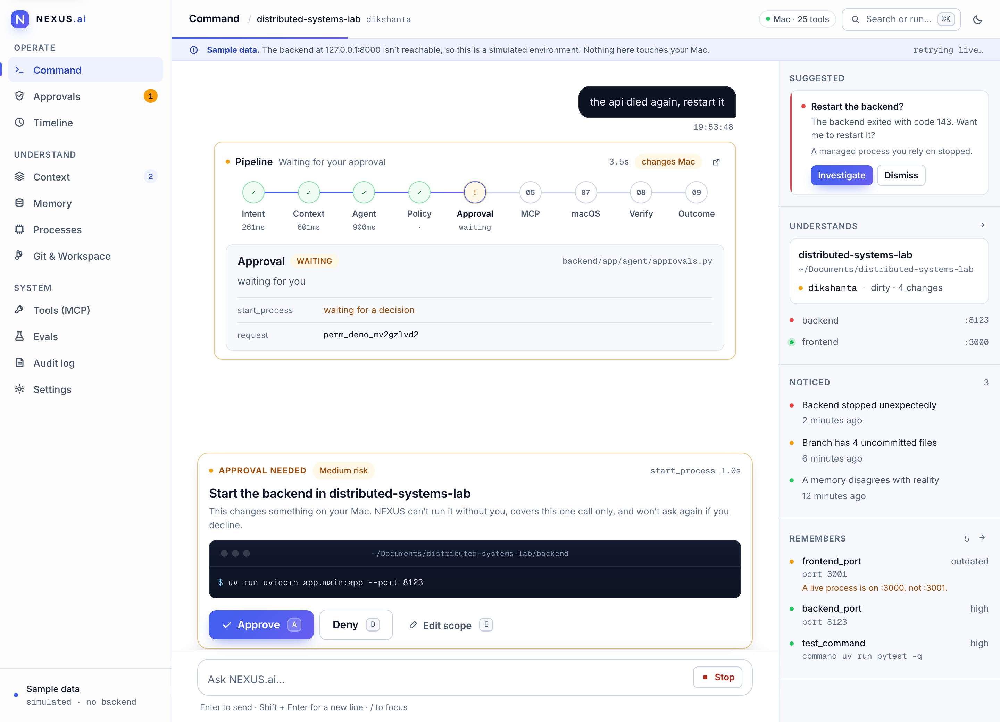
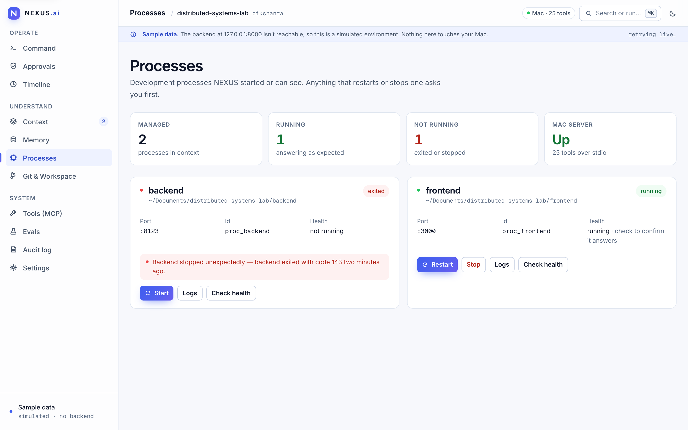
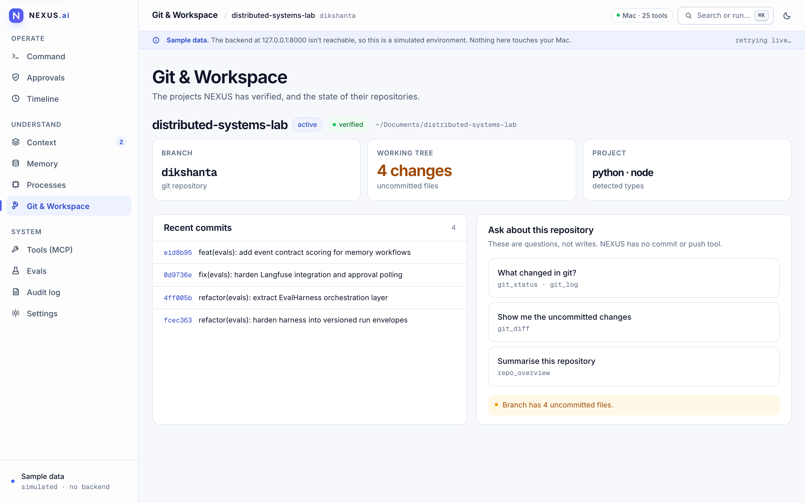
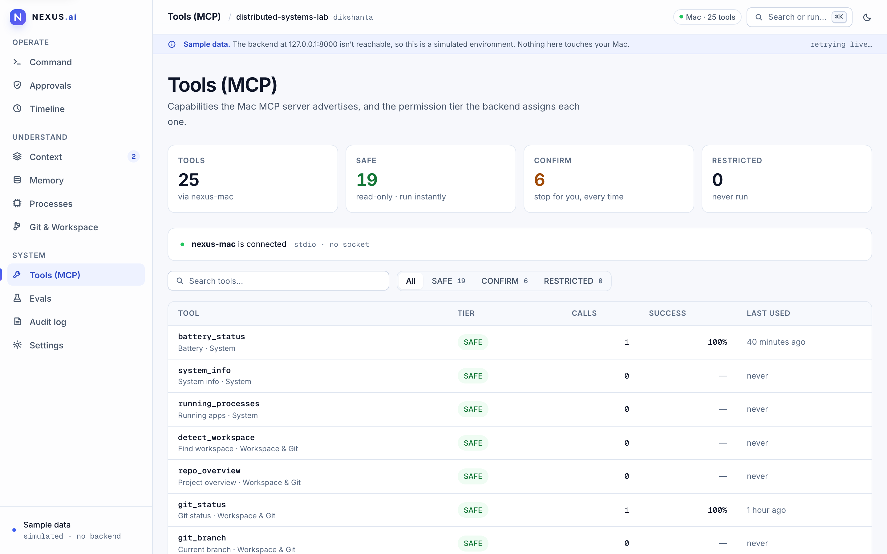
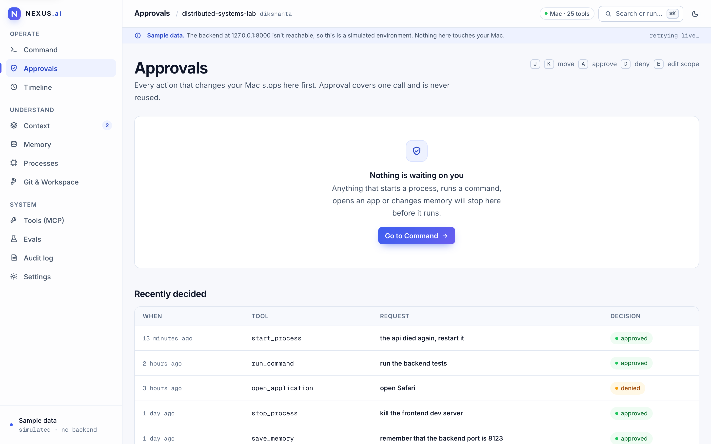
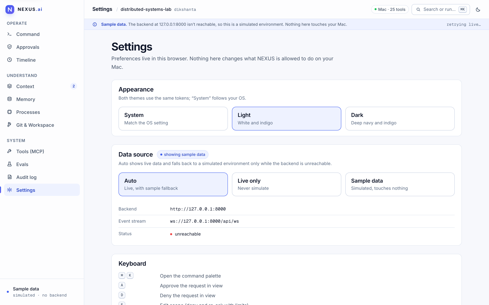
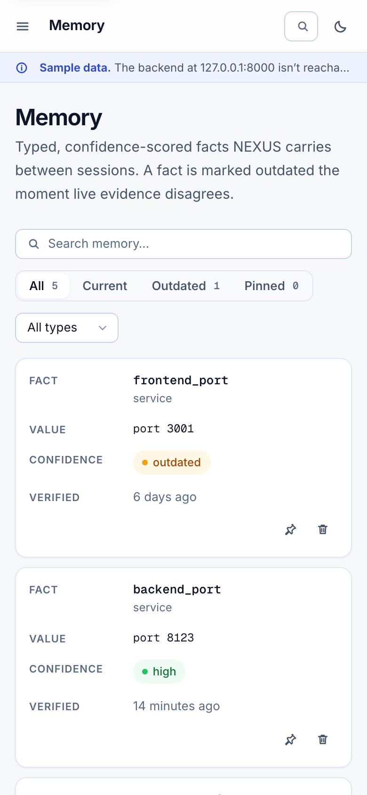
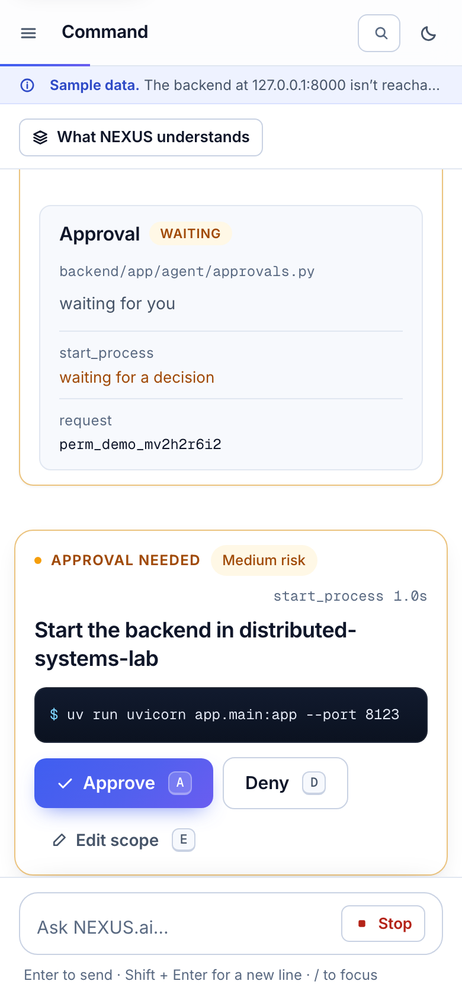

<div align="center">


# NEXUS.ai

**The AI layer that understands your Mac.**<br>
Understand your workspace. Act with approval. Verify the result.

<p>
  
  
  
  
  
  
</p>

<p>
  <a href="#quick-start"><strong>Get started</strong></a> ·
  <a href="#product-tour">Product tour</a> ·
  <a href="#trust-model">Trust model</a> ·
  <a href="docs/README.md">Screenshot gallery</a> ·
  <a href="DECISIONS.md">Architecture decisions</a>
</p>

<picture>
  <source media="(prefers-color-scheme: dark)" srcset="docs/images/landing-hero-dark.png">
  
</picture>

</div>

NEXUS.ai gives an AI agent a bounded, explainable view of your Mac — your
workspace, Git state, processes, local services, and durable project memory —
without turning your computer into an unattended automation target.

| **25** | **19** | **6** | **0** |
| :---: | :---: | :---: | :---: |
| Mac capabilities discovered over MCP | `SAFE` tools · read-only, run instantly | `CONFIRM` tools · stop for you, every time | Network listeners on the MCP server |

---

## Product tour

### 1. It reads your environment before it answers

Active workspace, branch, uncommitted changes, running servers and remembered
facts are gathered through read-only tools and shown to you — the same bundle the
model receives.

<picture>
  <source media="(prefers-color-scheme: dark)" srcset="docs/images/dashboard-command-dark.png">
  
</picture>

### 2. It stops before it changes anything

Every tool that changes your Mac is `CONFIRM`. The pipeline pauses at
**Approval**, shows the exact command and working directory, and waits for you.
Approval covers one call and is never reused.

<picture>
  <source media="(prefers-color-scheme: dark)" srcset="docs/images/flow-1-approval-gate-dark.png">
  
</picture>

### 3. It checks its own work

`SUCCESS` needs evidence, not a tool return. After the action NEXUS re-checks
with SAFE-only tools and reports what it actually observed.

<picture>
  <source media="(prefers-color-scheme: dark)" srcset="docs/images/flow-2-verified-outcome-dark.png">
  
</picture>

### 4. It remembers, and admits when memory is stale

Typed, confidence-scored facts live in SQLite and are marked `outdated` the
moment live evidence disagrees.

<picture>
  <source media="(prefers-color-scheme: dark)" srcset="docs/images/dashboard-memory-dark.png">
  
</picture>

### 5. It shows its receipts

Every request lands in a timeline and an exportable audit log — what was asked,
which tier it ran at, and what the decision was.

<table>
  <tr>
    <td width="50%"></td>
    <td width="50%"></td>
  </tr>
</table>

### 6. It is measured, not claimed

An external eval harness drives the live backend, scores each case
deterministically, repeats trials to catch flaky behaviour, diffs against a
baseline, and exports JUnit for CI. See [`evals/`](evals/README.md).


<details>
<summary><strong>More views</strong> — context, processes, Git, tools, settings, light and dark</summary>

<br>

<table>
  <tr>
    <td width="50%"></td>
    <td width="50%"></td>
  </tr>
  <tr>
    <td width="50%"></td>
    <td width="50%"><picture>
  <source media="(prefers-color-scheme: dark)" srcset="docs/images/dashboard-tools-dark.png">
  
</picture></td>
  </tr>
  <tr>
    <td width="50%"></td>
    <td width="50%"></td>
  </tr>
</table>

Everything above also ships in a dark theme — see the
[screenshot gallery](docs/README.md).

</details>

### Built for any screen

Tables collapse into labelled cards, the sidebar becomes a drawer, and the
approval gate stays one thumb away.

<table>
  <tr>
    <td align="center" width="25%"></td>
    <td align="center" width="25%"><picture><source media="(prefers-color-scheme: dark)" srcset="docs/images/mobile-memory-dark.png"></picture></td>
    <td align="center" width="25%"></td>
    <td align="center" width="25%"><picture><source media="(prefers-color-scheme: dark)" srcset="docs/images/mobile-approval-dark.png"></picture></td>
  </tr>
</table>

> **About these screenshots.** They were captured from the dashboard's built-in
> *sample-data* mode, a simulated environment the UI falls back to when no
> backend is reachable (it is labelled "Sample data" in the app). Nothing in
> them touches a real Mac. The landing-page replay and eval terminal are
> illustrative, as labelled on the page.

---

## Why NEXUS

Most AI developer tools begin with a blank chat. NEXUS begins with the
environment you are already working in. It gathers relevant context, lets
LangGraph choose from discovered MCP tools, pauses before anything changes
your Mac, and reports the evidence behind the result.

It is deliberately local, single-user, and approval-gated. The model chooses
what to ask for; the backend decides what may run; the Mac MCP server performs
the capability behind a real process boundary.

The backend binds to `127.0.0.1` on purpose. The MCP server has no socket and
must never be given one.

For the full architecture decision record — every mechanism, limit and
rationale, read out of the source — see **[DECISIONS.md](DECISIONS.md)**.

---

## What NEXUS does

### Context-aware assistance

- Detects the active workspace, Git branch, changed files, and running
  development processes
- Retrieves relevant durable memories from SQLite across sessions
- Uses deterministic intent and context rules before asking the model to act

### Controlled execution

- Discovers 25 capabilities from the bundled `nexus-mac-mcp` server
- Keeps read-only tools `SAFE`, machine-changing tools `CONFIRM`, and unknown
  tools `RESTRICTED`
- Routes every action through LangGraph, the tool registry, and the approval
  broker

### Closed-loop results

- Verifies declared actions with independent SAFE-only checks
- Distinguishes `SUCCESS`, `PARTIAL_SUCCESS`, `FAILED`, and `UNKNOWN`
- Shows evidence and a read-only execution trace instead of invented certainty

### Proactive, never autonomous

- Notices process failures, service changes, Git changes, and memory conflicts
- Offers suggestions as ordinary questions, never as hidden tool calls
- Keeps the user in control of every operation that changes the machine

---

## Core architecture

### The request path

```text
USER
 → FastAPI               POST /api/chat returns a task_id immediately
 → Intent                deterministic regex classification, no model call
 → Context               memories, workspace, git, processes, recent tasks
 → LangGraph / Agent     agent ⇄ tools, bounded
 → Tool Registry         neutral ToolDefinition / ToolResult vocabulary
 → Permission Policy     SAFE runs · CONFIRM stops · RESTRICTED never runs
 → Approval Broker       blocks the tool node until a human answers
 → MCP                   JSON-RPC over stdio to a child process
 → macOS
```

### What happens to a result

```text
Tool Result
 → Verification          SAFE-only re-check, against the tool's own contract
 → Outcome               SUCCESS · PARTIAL_SUCCESS · FAILED · UNKNOWN
 → Observations          deterministic sensors record what changed
 → Suggestions           an offer, phrased as a question — never a call
```

### How an explanation is built

```text
Task Events + Context + Registry Metadata
 → Trace                 a pure projection of what was already recorded
```

The trace adds no new source of truth. It can only show what already went out
on the WebSocket.

---

## Product model

These words mean specific, non-interchangeable things.

### Permission levels

| Level | Meaning |
| --- | --- |
| **SAFE** | Read-only. Runs immediately, no approval. 19 of the 25 tools. |
| **CONFIRM** | Changes something. Always stops for a human decision. 6 tools. |
| **RESTRICTED** | Never executed. Also the default for any tool nobody classified. |

### Units of work

| Term | Meaning |
| --- | --- |
| **Task** | One request, one `task_id`, one row in the in-memory `TaskStore`. |
| **Mission** | One request that implies several ordered steps. Each step runs through the *same* agent graph, with the same permission path. Not a second runtime. |

### What NEXUS knows

| Term | Meaning |
| --- | --- |
| **Context** | What was gathered *before* planning — memories, workspace, git, processes, recent tasks. Assembled fresh per request and bounded. |
| **Memory** | A durable fact in SQLite at `~/.nexus/nexus.db`. Typed, confidence-scored, soft-deleted. Survives restarts. |

### What NEXUS notices

| Term | Meaning |
| --- | --- |
| **Observation** | Something a deterministic sensor saw, unprompted. No model involved. States a fact; never triggers anything. |
| **Suggestion** | An offer derived from an observation. Holds an intent label and a natural-language **prompt** — no tool name, no arguments. |

### What NEXUS concludes

| Term | Meaning |
| --- | --- |
| **Verification** | An independent re-check, using SAFE tools only, against the contract the tool declared. |
| **Outcome** | The verdict — `SUCCESS`, `PARTIAL_SUCCESS`, `FAILED`, `UNKNOWN` — with evidence marked `OBSERVED` (seen) or `INFERRED` (capped at MEDIUM confidence). |
| **Trace** | The recorded decisions and evidence for one task, grouped into phases. |

---

## Trust model

**Proactive does not mean autonomous.** NEXUS observes on its own, offers on
its own, and explains on its own. Between noticing a problem and changing
anything on your machine there is always a person.

**Suggestions cannot execute tools.** `SuggestedAction` has no `tool` field and
no `arguments` field — not empty ones, none at all. Accepting a suggestion
sends its prompt to `POST /api/chat` exactly as if you had typed it. There is
deliberately no `POST /api/suggestions/{id}/execute`, and the frontend has no
endpoint that can invoke a tool.

**CONFIRM always goes through the approval broker.** Every one of them, every
time. Approval is per call and does not persist. A denial means the tool never
starts — the model is told it was refused and must say so.

**SUCCESS requires evidence, not a successful tool return.** `tool_completed`
only ever meant "the tool returned". Where a tool declares what success looks
like, NEXUS goes and checks, and reports what it actually found.

**Traces expose recorded decisions and evidence, never hidden
chain-of-thought.** There is no field anywhere in the trace that can hold model
reasoning, because reasoning is not recorded anywhere.

---

## Quick start

NEXUS currently runs on macOS and requires:

- Python 3.14+
- [uv](https://docs.astral.sh/uv/)
- Node.js and npm
- A tool-calling model from Groq or Mistral

The backend and MCP server are local. The model provider is the only external
service NEXUS contacts.

> **Model limits.** Each agent request offers all 25 tool schemas to the model
> (~3.6k tokens). On Groq's free tier the cap is 8,000 tokens/minute per model,
> so multi-step requests can pause on `429` retries for tens of seconds. A paid
> Groq tier removes the wait; the model choice itself is not the bottleneck.

### 1. Configure and start the backend

```bash
cd backend
uv sync
cp .env.example .env
#   Set GROQ_API_KEY. The example file defaults to GROQ_MODEL=qwen/qwen3.8-27b.
#   Or configure MISTRAL_API_KEY, MISTRAL_MODEL (default ministral-8b-latest)
#   and DEFAULT_MODEL_PROVIDER=mistral.
uv run uvicorn app.main:app --reload --host 127.0.0.1 --port 8000
```

The backend automatically starts the bundled MCP server over stdio. Verify both
the API and the MCP connection:

```bash
curl http://127.0.0.1:8000/health
curl http://127.0.0.1:8000/api/models
curl http://127.0.0.1:8000/api/mcp/servers
```

### 2. Start the frontend

```bash
cd frontend
npm install
npm run dev            # http://localhost:3000
```

Open <http://localhost:3000/dashboard>. The frontend talks to
`http://127.0.0.1:8000` by default. To point it elsewhere, set
`NEXT_PUBLIC_NEXUS_API` before starting Next.js.

### 3. MCP lifecycle

You do not start the MCP server yourself during normal use. The backend spawns
it as a child process over stdio and keeps the session pool open, so a process
started in one turn remains available in the next. Run it standalone only for
protocol debugging:

```bash
cd nexus-mac-mcp
uv run python -m nexus_mac_mcp
```

### Try it without the UI

```bash
curl -X POST http://127.0.0.1:8000/api/chat \
  -H 'Content-Type: application/json' \
  -d '{"message": "What is my battery percentage?"}'
# {"task_id": "task_...", "status": "started"}

curl http://127.0.0.1:8000/api/tasks/task_...
curl http://127.0.0.1:8000/api/tasks/task_.../trace
```

Follow live on `WS /api/ws` (all events) or `WS /api/ws?task_id=...` (one task).
Interactive API docs: <http://127.0.0.1:8000/docs>.

### Tests

```bash
cd backend        && uv run pytest
cd nexus-mac-mcp  && uv run pytest                  # no windows opened
cd nexus-mac-mcp  && uv run pytest -m integration   # opt-in macOS checks
cd frontend       && npm run lint && npm run build
cd evals          && uv run pytest                  # harness, offline
```

MCP integration tests are opt-in so a plain `pytest` never launches apps on
your machine.

### Evals

The [eval harness](evals/README.md) drives the live backend over HTTP and
scores each case deterministically. It can repeat trials to flag flaky cases,
compare against a baseline to catch regressions, and export JUnit for CI:

```bash
cd evals && uv run pytest                        # offline: no backend, no model
cd evals && uv run python -m src --check         # offline: credentials/URL only

# LIVE: real model calls, and --approve really approves CONFIRM tools
# (it will, for example, open apps on this Mac). --dry-run only skips Langfuse.
cd evals && uv run python -m src -d core --approve --repeat 3 \
  --compare results/core.json --junit results/junit.xml --fail-under 0.85
```

Every run lands in `evals/results/` and is browsable at
<http://localhost:3000/evals>.

---

## Repository map

| Path | Process | Job |
| --- | --- | --- |
| [`frontend/`](frontend/) | Browser | Show the same facts the model was given, stream the run, collect approvals |
| [`backend/`](backend/) | Python, loopback | Orchestrate the agent. Own permissions. Never execute Mac code itself |
| [`nexus-mac-mcp/`](nexus-mac-mcp/) | Child of the backend | Touch the machine. Declare permission metadata. Enforce filesystem and command policy |
| [`evals/`](evals/) | External client | Drive the backend like a user would, score it, gate regressions |

The layering is strict and one-way:

```text
API → runner → LangGraph → tool registry → MCP → macOS
```

Routes never call a model, an MCP server, or a tool. The MCP server never
enforces permissions — it *declares* a level; the backend's policy and approval
broker decide whether the call runs. That split is load-bearing: a second
permission system in the child process would drift from the one the UI talks to.

```text
backend/app/
├── main.py            app factory — lifespan, CORS, error envelopes
├── api/               routers, schemas, websocket — thin, no agent logic
├── agent/             runner, graph, nodes, events, tasks, approvals
├── mission/           detection, planner, engine, state
├── context/           intent, collector, relevance, extraction
├── memory events      context/memory_events.py
├── observations/      rules, detector, scheduler, store
├── suggestions/       rules, engine, store
├── verification/      planner, verifier, outcomes
├── trace/             builder, explain, models
├── tools/             registry, permission classification
├── mcp/               the only place MCP concepts exist
├── models/            groq, mistral, router
└── core/              config, errors, logging

nexus-mac-mcp/src/nexus_mac_mcp/
├── server.py          tool declarations + permission metadata
├── tools/             thin adapters
└── core/              enforcement: filesystem, commands, processes, memory

frontend/src/
├── lib/useNexus.js    the entire client connection (REST + WebSocket)
├── lib/api.js         the one place the frontend knows the backend's shape
├── lib/evals.js       server-only reader for evals/results/*.json
└── app/               landing page, dashboard, evals, components
```

### Frontend state rule

```text
REST      = authoritative state (on load, and again on every reconnect)
WebSocket = incremental updates while connected
Backend   = the source of truth, always
```

Only `/api/context` is polled, because it is the one thing with no event of its
own. Everything else arrives on the socket.

---

## What this is not

- **Not a remote agent.** Binding the backend off loopback would expose a
  process that can act on this Mac. There is no authentication; anyone who can
  reach the port is the user.
- **Not a shell.** `run_command` is a profile matcher over an allowlist of
  executables and argument shapes. No pipes, no redirection, no chaining.
- **Not a vector store.** Memory is a small structured SQLite table scored with
  named, deterministic signals. No embeddings, no RAG.
- **Not persistent beyond memory.** Tasks, observations, suggestions and
  pending approvals live in the backend process and are gone when it restarts.

Deliberately absent, and not on a roadmap: browser automation, AppleScript,
GUI/keyboard/mouse control, email, calendar, cloud memory, multi-user support,
arbitrary shell execution, autonomous remediation, and any second path to
executing a tool.

Secrets live in `backend/.env` (gitignored). Only `.env.example` files are
committed.
