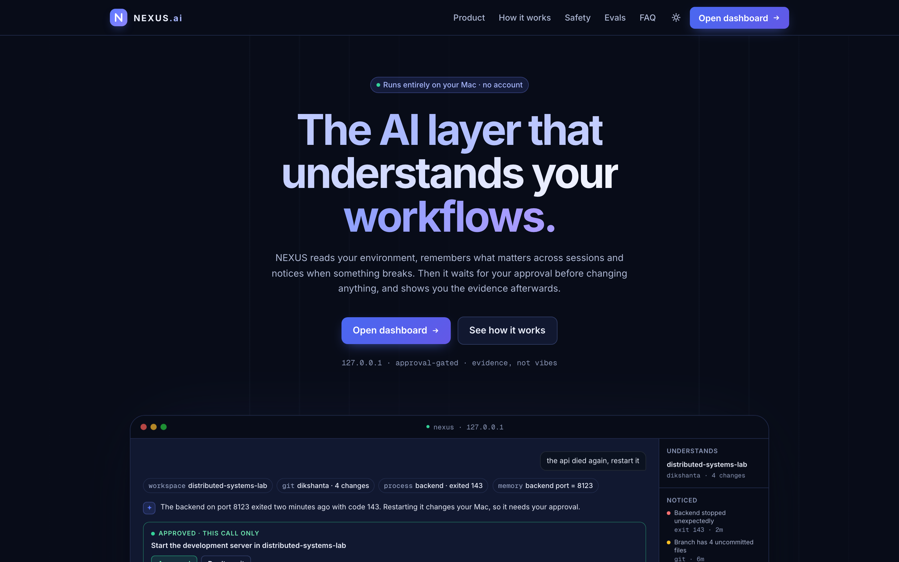
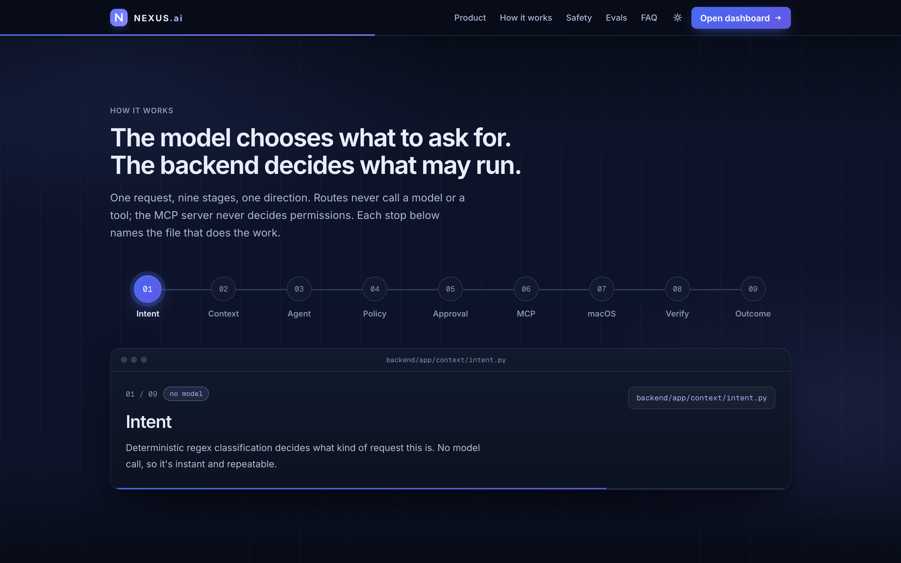
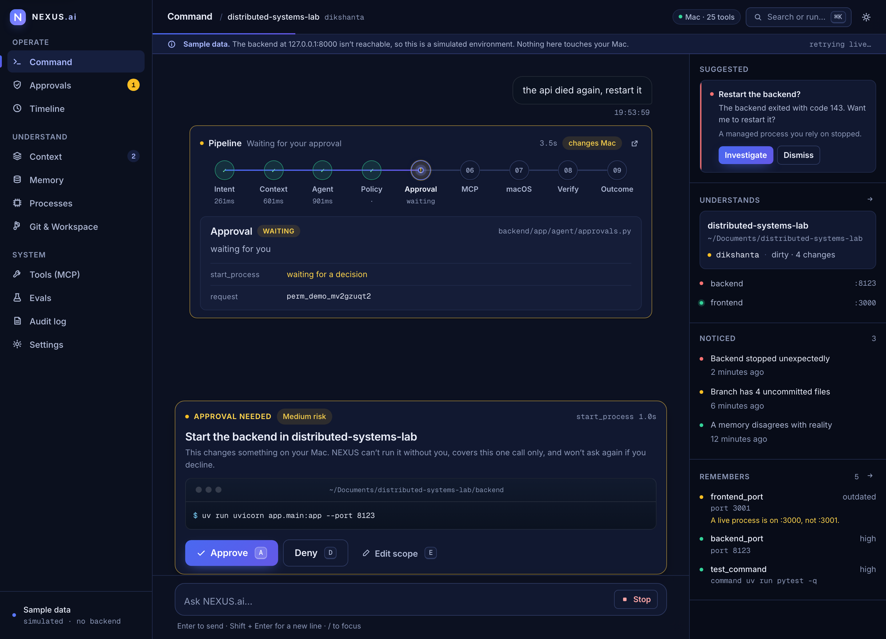
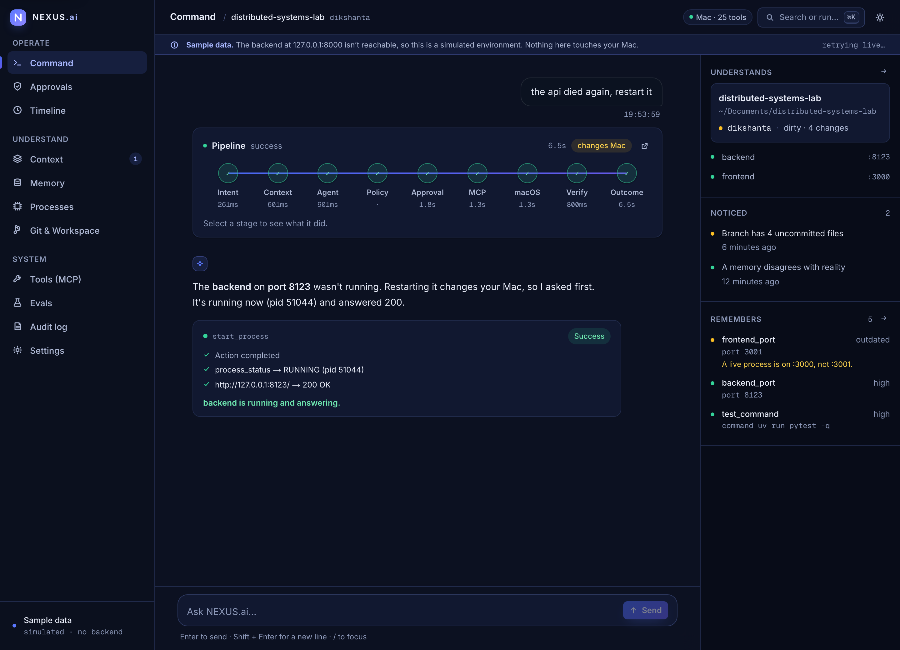
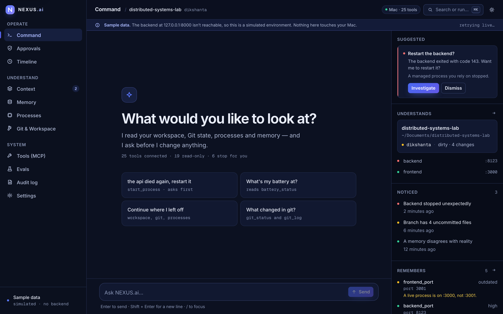
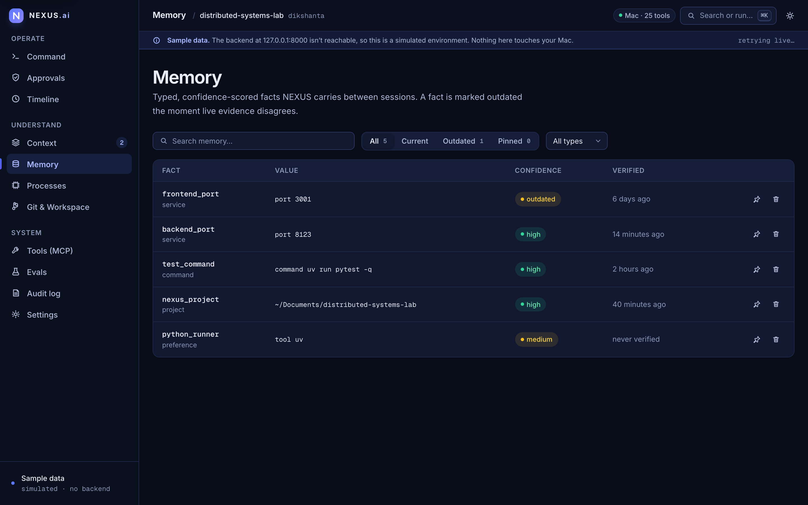
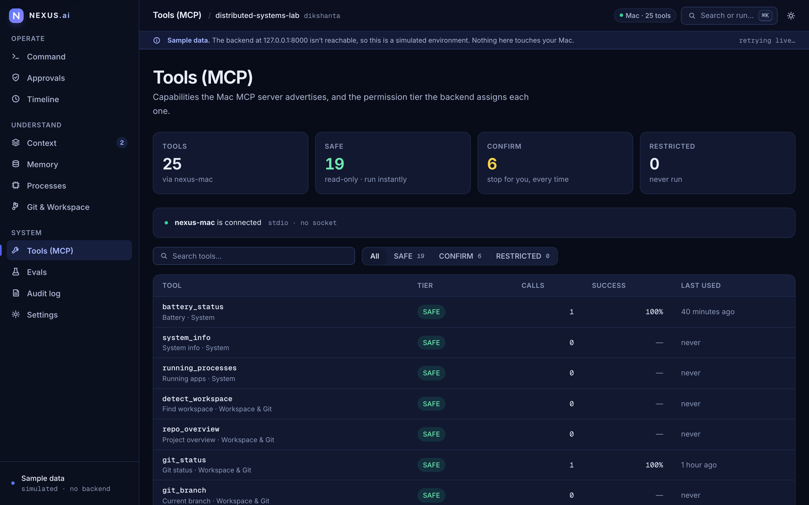
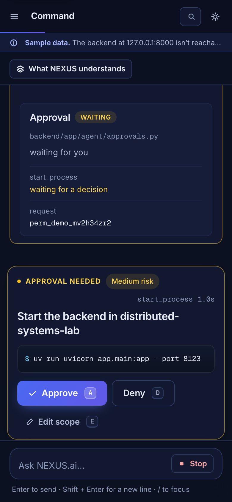
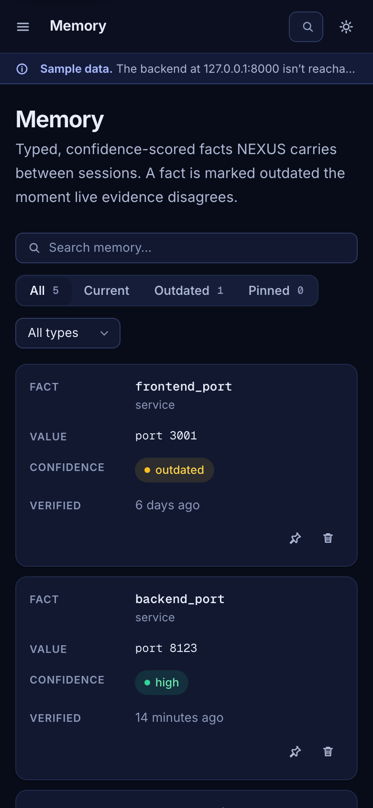

# NEXUS.ai — screenshot gallery

All images are 2× captures of the real frontend (1440 px desktop, 390 px phone). Dashboard images come from the built-in **sample-data mode**, a simulated environment labelled in the app; nothing in them touches a real Mac.

Both themes use the same tokens from [`frontend/src/app/tokens.css`](../frontend/src/app/tokens.css). The README uses `<picture>` so GitHub shows the image matching the reader's theme.

## Landing page

### Landing · Capabilities

### Landing · Eval Harness

### Landing · Hero

| Light | Dark |
| --- | --- |
|  |  |

### Landing · How It Works

| Light | Dark |
| --- | --- |
|  |  |

### Landing · Product Preview

### Landing · Quick Start

### Landing · Safety

## Request flow — ask, approve, verify

### 1 · Approval Gate

| Light | Dark |
| --- | --- |
|  |  |

### 2 · Verified Outcome

| Light | Dark |
| --- | --- |
|  |  |

## Dashboard

### Dashboard · Approvals

### Dashboard · Audit Log

### Dashboard · Command

| Light | Dark |
| --- | --- |
|  |  |

### Dashboard · Context

### Dashboard · Git & Workspace

### Dashboard · Memory

| Light | Dark |
| --- | --- |
|  |  |

### Dashboard · Processes

### Dashboard · Settings

### Dashboard · Timeline

### Dashboard · Tools

| Light | Dark |
| --- | --- |
|  |  |

## Phone (390 px)

### Phone · Approval

| Light | Dark |
| --- | --- |
|  |  |

### Phone · Landing

### Phone · Memory

| Light | Dark |
| --- | --- |
|  |  |

### Phone · Timeline

